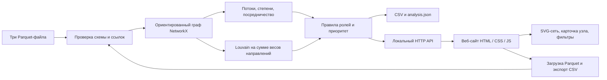

# Архитектура

```mermaid
flowchart LR
  A[Три Parquet-файла] --> B[Проверка схемы и ссылок]
  B --> C[Ориентированный граф NetworkX]
  C --> D[Потоки, степени, посредничество]
  C --> E[Louvain на сумме весов направлений]
  D --> F[Правила ролей и приоритет]
  E --> F
  F --> G[CSV и analysis.json]
  F --> H[Локальный HTTP API]
  H --> I[Веб-сайт HTML / CSS / JS]
  I --> J[SVG-сеть, карточка узла, фильтры]
  I --> K[Загрузка Parquet и экспорт CSV]
  K --> B
```

CLI и сервер используют одну функцию analyze. Парсинг и аналитика на Python; браузер отвечает за взаимодействие и визуализацию. Внешних сервисов нет.
